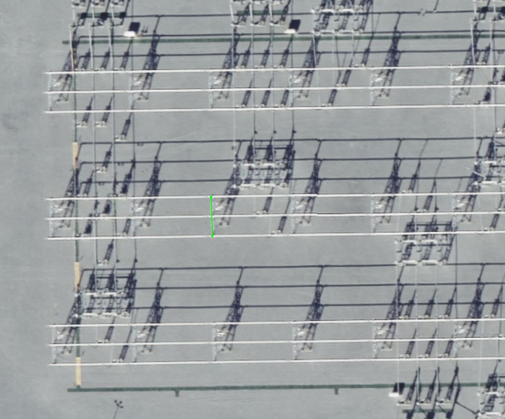
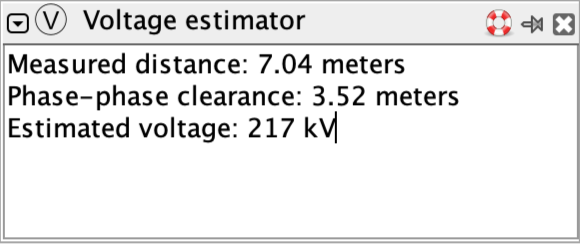

# JOSM Power Network Tools Plugin
This is a plugin for the [JOSM OpenStreetMap editor](https://josm.openstreetmap.de/) to provide
specialist power network mapping tools. It can be installed through the JOSM plugin preferences
pane.

This plugin currently provides one tool (with hopefully more to follow):

## Voltage Estimator
This tool estimates the voltage of a substation busbar from aerial imagery by measuring the
clearance between conductors. The clearance is dictated by the voltage and so allows an estimate
of the voltage to be made.

Although not a perfect method, when combined with knowledge of a country's standard power grid
voltages and power infrastructure layout this can greatly assist mappers in assigning voltages
to power infrastructure from aerial imagery.

### Limitations
Please ensure you completely understand the behaviour and limitations of this tool before using it!
It can only be used within air-insulated substations, **not on power lines**. Experience in power grid
mapping is required in order to interpret the resulting values.

The estimated voltage is calculated using a linear regression based on measurements taken
in a number of countries worldwide. Design standards vary between countries and the estimates may
differ from the operational voltages by up to 30%, although this offset is usually fairly constant
for each voltage within a country's power grid.

In rare cases, substations may be rated for higher voltages than they operate at, and care should
be taken if you are mapping in an area where this is the case.

In hilly areas, especially where imagery providers don't have up to date, high resolution elevation
data, measurements may be affected by orthorecrification errors which will cause errors in voltage
estimates. This should be usually be obvious from visible image distortion.

This tool does not produce voltage estimates for voltages lower than 75 kV or higher than 700 kV as
it's not currently possible to produce a reliable estimate outside this range. Clearances for lower
voltages are mostly dictated by the size of birds rather than voltage and, notably, 765 kV
substations worldwide appear to use a significantly higher clearance distance than would be predicted
for that voltage level.

Busbars can be made from solid tubes/bars, or from flexible power lines. Solid busbars are more common
in modern substations. Clearance is generally higher for flexible busbars than for solid busbars, so 
this tool will tend to under-estimate the voltage of a solid busbar, and over-estimate the voltage of
a flexible busbar.

### Usage
Identify a point in the substation where the three phases are spaced horizontally in a busbar or
bay, insulated by air. Avoid transformer and circuit breaker bushings, which may also have some vertical
separation. If the separation of a voltage level varies, find the section with closest separation,
while keeping in mind that some narrow parts may have vertical separation which isn't obvious.

Enable voltage measurement mode by pressing the `v` key or selecting the voltage estimator tool from
the edit toolbar. Use the tool to draw a line across all three phases of the busbar, perpendicular
to the direction of the conductors.

The measured distance and estimated voltage will be shown in the "Voltage estimator" panel.

In most cases, the closest power grid voltage to this estimated number will be the correct voltage,
but you should always verify this makes sense with the power network topology.

## Development

See the [Developing Plugins](https://josm.openstreetmap.de/wiki/DevelopersGuide/DevelopingPlugins) guide.
To build this plugin:

* `ant` will build the plugin.
* `ant install` will attempt to install it to your JOSM plugins dir.

If a `josm.jar` file is not present in the `lib` directory, the latest version will be downloaded
automatically.

### Releasing
Change the version number in `build.xml` then push a `vx.y.z` tag. A release will be created.
